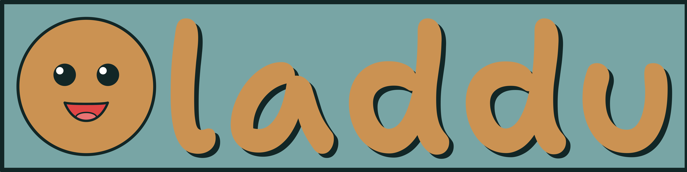

<p align="center">
  
</p>

<h1 align="center">Amplitude analysis made short and sweet</h1>

<p align="center">
  <a href="https://github.com/denehoffman/laddu/releases"></a>
  <a href="https://github.com/denehoffman/laddu/commits/main/"></a>
  <a href="https://github.com/denehoffman/laddu/actions"></a>
  <a href="LICENSE-APACHE"></a>
  <a href="https://crates.io/crates/laddu"></a>
  <a href="https://docs.rs/laddu"></a>
  <a href="https://laddu.readthedocs.io/en/latest/"></a>
  <a href="https://app.codecov.io/github/denehoffman/laddu/tree/main/"></a>
  <a href="https://pypi.org/project/laddu/"></a>
  <a href="https://codspeed.io/denehoffman/laddu"></a>
</p>

`laddu` (/ˈlʌduː/) is a Python library for building, evaluating, generating, and fitting particle-physics amplitude models. Its symbolic interface is backed by a Rust runtime with automatic differentiation, multithreaded CPU execution, JIT compilation, WGPU acceleration, and optional MPI distribution.

> [!CAUTION]
> `laddu` is under active development and its API may change before 1.0. Pin the package version used for production analyses.

## Installation

`laddu` requires Python 3.11 or later:

```bash
uv add laddu
```

Install the MPI backend in an environment with a working MPI implementation:

```bash
uv add "laddu[mpi]"
```
(or use your favorite package manager)

Published wheels include generated type information. When building a public module directly from an sdist, pass `--config-settings="maturin.build-args=--generate-stubs"` to `pip` or `uv` to generate the same stubs locally.

## A small model

Models are expression graphs assembled from event data, constants, and parameters:

```python
import laddu as ld

s = ld.scalar("s")
mass = ld.parameter("mass", initial=1.5, bounds=(1.3, 1.7))
width = ld.parameter("width", initial=0.1, bounds=(0.01, 0.3))
amplitude = 1.0 / (mass**2 - s - 1j * mass * width)
model = ld.Model(amplitude.norm_sqr())

print(model.parameter_names)
```

The [Python documentation](https://laddu.readthedocs.io/en/latest/) covers reactions, data I/O, common amplitudes, Monte Carlo generation, fitting, cross sections, MPI, and runtime selection. Rust users can find the public crate documentation on [docs.rs](https://docs.rs/laddu).

## Citation and acknowledgments

If `laddu` contributes to published work, cite the software metadata in [`CITATION.cff`](CITATION.cff) and record the exact package version and execution capabilities used by the analysis.

`laddu` builds on [NumPy](https://numpy.org/), [PyO3](https://pyo3.rs/) and [Maturin](https://www.maturin.rs/), [Ganesh](https://crates.io/crates/ganesh), [Apache Arrow and Parquet](https://arrow.apache.org/), [oxyroot](https://crates.io/crates/oxyroot), [wgpu](https://wgpu.rs/), and the [Message Passing Interface](https://www.mpi-forum.org/). The Wigner-symbol implementation includes code derived from [WignerSymbol](https://github.com/0382/WignerSymbol); its complete license is preserved in [`THIRD_PARTY_NOTICES`](THIRD_PARTY_NOTICES).

## License

`laddu` is available under either the [MIT License](LICENSE-MIT) or the [Apache License 2.0](LICENSE-APACHE), at your option.
