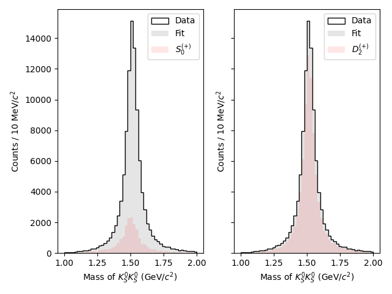
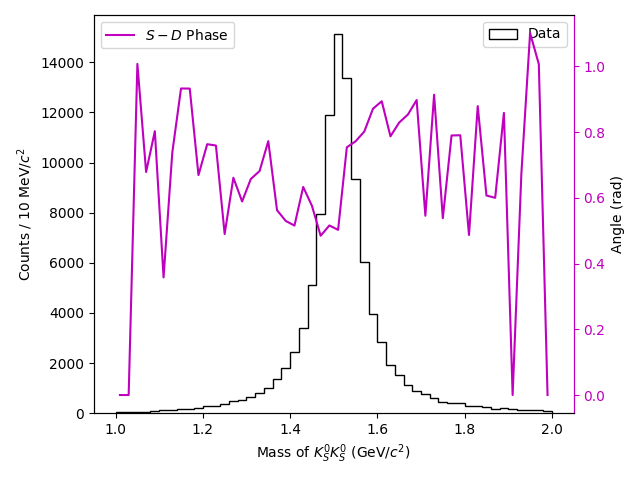

Binned Fitting Tutorial
=======================

.. note:: See :doc:`unbinned_fit` to learn the basics of fitting with ``laddu`` before starting this tutorial.

Theory
------

Let's first define some terms. In the "unbinned" tutorial, we focused on fitting an intensity function which depended on both the angular distributions of the associated decays as well as the invariant mass of the decay particle. However, this requires us to assume a mass model [#f1]_, which might not always be simple or known. Sometimes, all we want to know (or all we are able to calculate) is the amount of a certain wave in a certain range of mass. Such a fit can help us visualize the underlying mass model, as well as test out the influence of using different sets of partial waves, with a much simpler fit on fewer free parameters. It does have some downsides, of course. The most obvious is that you don't get a mass model from such a fit, or any information about pole positions or decay widths. Additionally, by construction, the results from bin to bin have no influence on each other, so complex phases might jump around arbitrarily between bins. In this same vein, a particular fit result may have a completely mathematically equivalent minimum as another, only differing on some underlying phases. In a mass-dependent model, we would fall into only one of these minima for the entire dataset, but in a binned fit, each bin might fall into its own minimum, leading to discontinuities in things like the phase between partial waves.

Despite these downsides, it can still be advantageous to calculate binned fits, so ``laddu`` tries to make the process as straightforward as possible.

Example
-------

We could approach a binned fit in one of two ways. First, we could use a piecewise amplitude to describe a number of parameters over the entire dataset. This means the minimization procedure will have many free parameters, one or two per wave per bin, and this might slow down the actual minimization process. The other way would be to make a simple model that works for one bin, then split the data up into bins and fit each one separately. We will do the latter here.

Like before, we begin by loading each dataset, but this time we can chain a method that will generate a ``BinnedDataset`` instead. This will contain all of the same events as the original ``Dataset``, but acts as a list where each element is a ``Dataset`` that only contains events in a particular bin:

.. code-block:: python

   import laddu as ld

   res_mass = ld.Mass([2, 3])
   bins = 50
   mass_range = (1.0, 2.0)

   data_ds = ld.open("data.parquet")
   accmc_ds = ld.open("accmc.parquet")
   # We'll want to retain the unbinned datasets for plotting later

   binned_data_ds = data_ds.bin_by(res_mass, bins, mass_range)
   binned_accmc_ds = accmc_ds.bin_by(res_mass, bins, mass_range)

Next, we construct a binned model. Following the form of the model from the previous tutorial, we can ignore the mass-dependent terms and write:

.. math::
   I(\theta, \varphi, P_{\gamma}, \Phi) \propto &\left| [S_0^{(+)}] \Re\left[Z_{0}^{0(+)}(\theta, \varphi, P_\gamma, \Phi)\right]\right.\\
   &\left. + [D_2^{(+)}] \Re\left[Z_{2}^{2(+)}(\theta, \varphi, P_\gamma, \Phi)\right]\right|^2 \\
   + &\left| [S_0^{(+)}] \Im\left[Z_{0}^{0(+)}(\theta, \varphi, P_\gamma, \Phi)\right]\right.\\
   &\left. + [D_2^{(+)}] \Im\left[Z_{2}^{2(+)}(\theta, \varphi, P_\gamma, \Phi)\right]\right|^2

where the terms with particle names in square brackets still represent the production coefficients. We additionally need to allow one of these to be purely real to fully constrain the problem (as the squared norm of a complex value is invariant up to a total phase). We can translate all of this into a ``Model``:

.. code-block:: python

   manager = ld.Manager()
   angles = ld.Angles(0, [1], [2], [2, 3])
   polarization = ld.Polarization(0, [1])

   z00p = manager.register(ld.Zlm("Z00+", 0, 0, "+", angles, polarization))
   z22p = manager.register(ld.Zlm("Z22+", 2, 2, "+", angles, polarization))

   s0p = manager.register(ld.Scalar("S0+", ld.parameter("Re[S0+]")))
   d2p = manager.register(ld.ComplexScalar("D2+", ld.parameter("Re[D2+]"), ld.parameter("Im[D2+]")))

   positive_real_sum = (s0p * z00p.real() + d2p * z22p.real()).norm_sqr() 
   positive_imag_sum = (s0p * z00p.imag() + d2p * z22p.imag()).norm_sqr() 
   model = manager.model(positive_real_sum + positive_imag_sum)

Now, rather than construct a single ``NLL`` for the entire dataset, we instead make one for each bin:

.. code-block:: python

   nlls = [ld.NLL(model, binned_data_ds[ibin], binned_accmc_ds[ibin]) for ibin in range(bins)]
   
   binned_statuses = []
   for nll in nlls:
      binned_statuses.append(nll.minimize([100.0, 100.0, 100.0]))

Now that we have all of the fit results, we could (and should) save them to a file. These are very lightweight objects in terms of memory, so we can just use the ``pickle`` module built into Python:

.. code-block:: python

   import pickle
   from pathlib import Path

   pickle.dump(binned_statuses, Path("binned_statuses.pkl").open("wb")) # 'wb' for *binary* writing mode
   # We can load this up later with
   # binned_statuses = pickle.load(Path("binned_statuses.pkl").open("rb"))

Finally, let's visualize the results. We could get the weights in each bin and associate them with the original data. We can obtain a new dataset with the events in the same order as the binned datasets by adding binned datasets in order:

.. code-block:: python

   import numpy as np
   sorted_accmc_ds = sum([ds for ds in binned_accmc_ds])
   assert sorted_accmc_ds != 0 # this line is for type-checkers only!
   tot_weights = np.concatenate([np.array(nlls[ibin].project(binned_statuses[ibin].x)) for ibin in range(bins)])
   s0p_weights = np.concatenate([np.array(nlls[ibin].project_with(binned_statuses[ibin].x, ["S0+", "Z00+"])) for ibin in range(bins)])
   d2p_weights = np.concatenate([np.array(nlls[ibin].project_with(binned_statuses[ibin].x, ["D2+", "Z22+"])) for ibin in range(bins)])

Then, plotting would just involve something like ``plt.hist(res_mass.value_on(sorted_accmc_ds), bins, range=mass_range, weights=tot_weights)``. We could also do the following:

.. code-block:: python

   import numpy as np
   edges = np.histogram_bin_edges([], bins, mass_range)

   tot_counts = []
   s0p_counts = []
   d2p_counts = []

   for ibin in range(bins):
       tot_counts.append(sum(nlls[ibin].project(binned_statuses[ibin].x)))
       s0p_counts.append(sum(nlls[ibin].project_with(binned_statuses[ibin].x, ["S0+", "Z00+"])))
       d2p_counts.append(sum(nlls[ibin].project_with(binned_statuses[ibin].x, ["D2+", "Z22+"])))
   
We now have some stuff that looks like the *output* of ``np.histogram``, but we need to turn this into a plot. We can either use ``plt.stairs(counts, edges)`` or ``plt.hist(edges[:-1], edges, weights=counts)`` to do this, although the first option will be used here for simplicity.

.. code-block:: python

   import matplotlib.pyplot as plt

   fig, ax = plt.subplots(ncols=2, sharey=True)

   # Plot the data on both axes
   m_data = res_mass.value_on(data_ds)
   ax[0].hist(m_data, bins=bins, range=mass_range, color="k", histtype="step", label="Data")
   ax[1].hist(m_data, bins=bins, range=mass_range, color="k", histtype="step", label="Data")

   # Plot the total fit on both axes
   ax[0].stairs(tot_counts, edges, color="k", alpha=0.1, fill=True, label="Fit")
   ax[1].stairs(tot_counts, edges, color="k", alpha=0.1, fill=True, label="Fit")

   # Plot the S-wave on the left
   ax[0].stairs(s0p_counts, edges, color="r", alpha=0.1, fill=True, label="$S_0^{(+)}$")

   # Plot the D-wave on the right
   ax[1].stairs(d2p_counts, edges, color="r", alpha=0.1, fill=True, label="$D_2^{(+)}$")

   ax[0].legend()
   ax[1].legend()
   ax[0].set_ylim(0)
   ax[1].set_ylim(0)
   ax[0].set_xlabel("Mass of $K_S^0 K_S^0$ (GeV/$c^2$)")
   ax[1].set_xlabel("Mass of $K_S^0 K_S^0$ (GeV/$c^2$)")
   ax[0].set_ylabel("Counts / 10 MeV/$c^2$")
   ax[1].set_ylabel("Counts / 10 MeV/$c^2$")
   plt.tight_layout()
   plt.show()

We can also apply the same method as before with the generated Monte Carlo to plot the efficiency-corrected result, but this is left as an exercise for the reader.

Another useful plot to make is the phase difference between waves. Here we only have two waves, so the choice of which phases to plot is trivial:

.. code-block:: python

   sd_phase = []
   for ibin in range(bins):
       s = binned_statuses[ibin].x[0] + 0j
       d = binned_statuses[ibin].x[1] + 1j * binned_statuses[ibin].x[2]
       phase = abs(np.angle(s) - np.angle(d))
       sd_phase.append(min(phase, 2 * np.pi - phase))

   fig, ax = plt.subplots()
   ax.hist(
       m_data,
       bins=bins,
       range=mass_range,
       weights=data_ds.weights,
       color='k',
       histtype='step',
       label='Data',
   )
   phase_ax = ax.twinx()
   centers = (edges[1:] + edges[:-1]) / 2
   phase_ax.plot(centers, sd_phase, color='m', label='$S-D$ Phase')
 
   ax.legend()
   phase_ax.legend()
   ax.set_ylim(0)
   ax.set_xlabel('Mass of $K_S^0 K_S^0$ (GeV/$c^2$)')
   ax.set_ylabel('Counts / 10 MeV/$c^2$')
   phase_ax.set_ylabel('Angle (rad)')
   phase_ax.spines['right'].set_color('m')
   phase_ax.tick_params(axis='y', colors='m')
   plt.tight_layout()
   plt.savefig('binned_fit_result_phase.png')
   plt.close()

Of course, in the phase plot, the values towards either edge of the main peak are likely to be poorly constrained, but notice the ascending motion near the middle of the peak.

.. rubric:: Footnotes

.. [#f1] This entire discussion can also apply to other variables, such as Mandelstam variables. For now, we will just describe the process using the invariant mass of the decaying particle.
